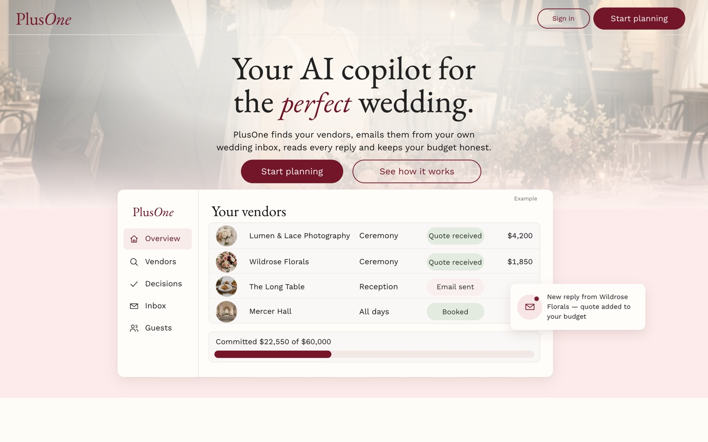
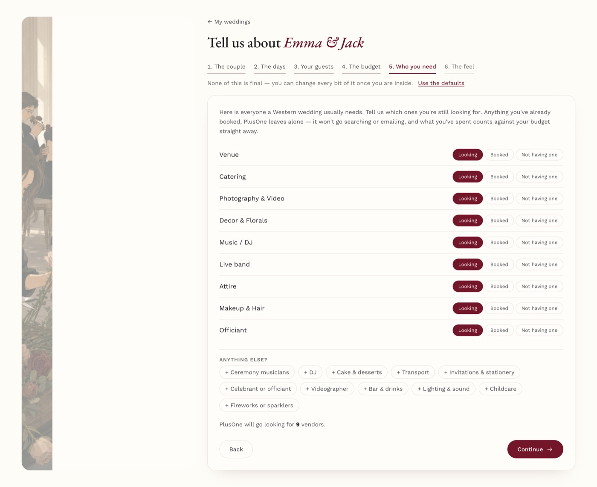
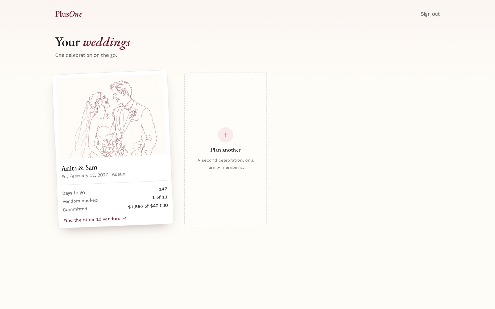
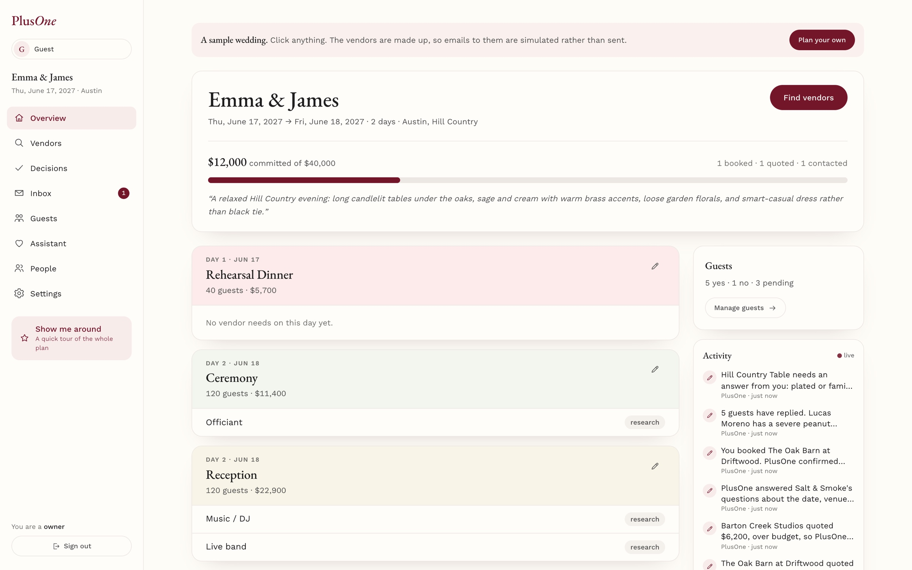
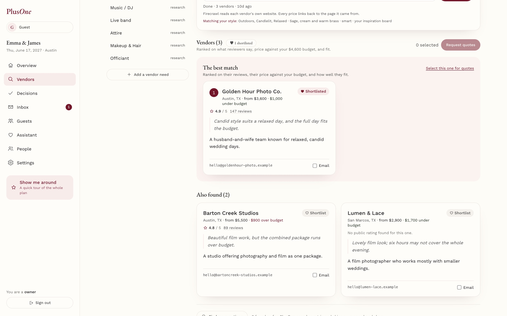
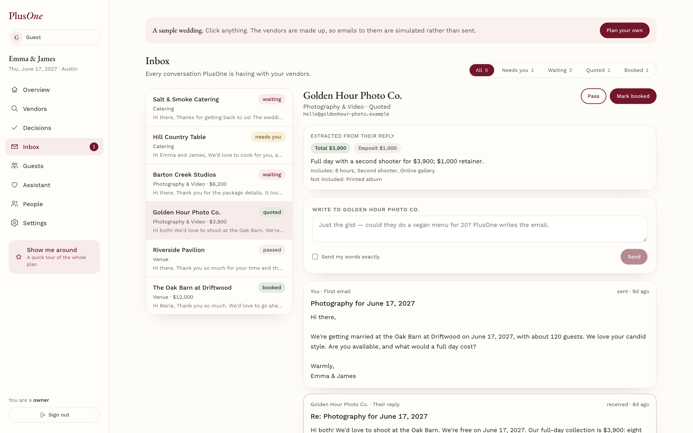
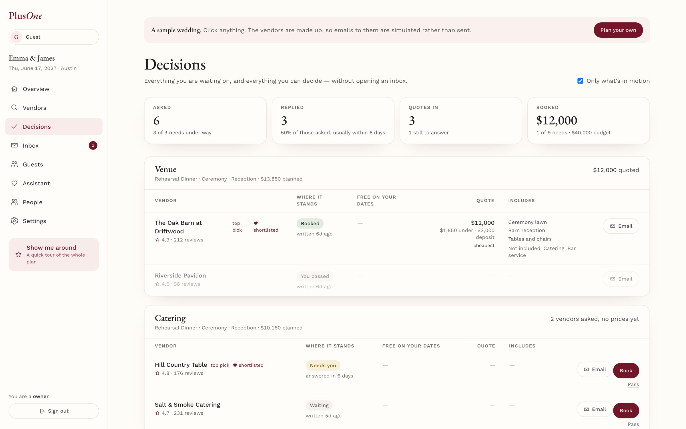
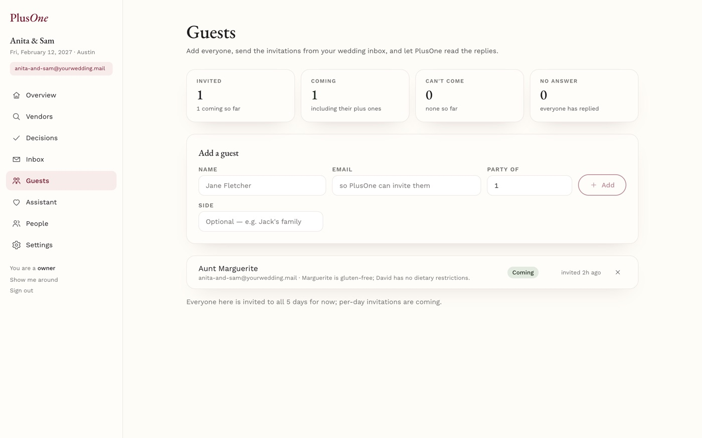
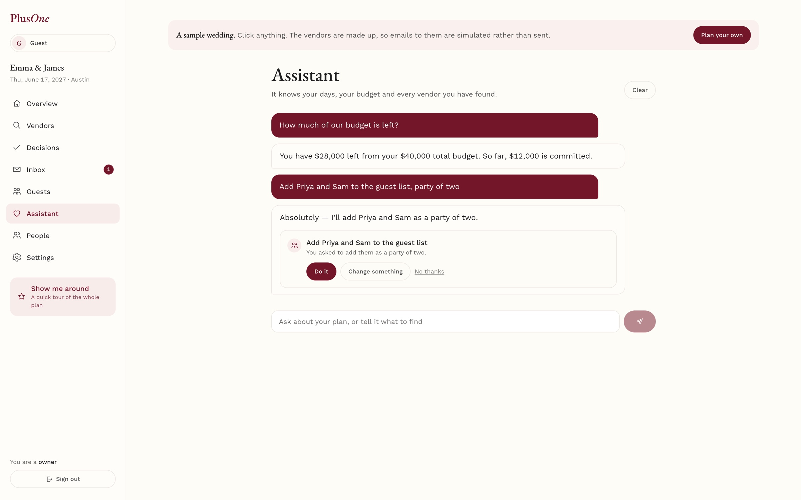

# PlusOne

**Your AI Copilot for the Perfect Wedding.**

> **Convex All Gas Hackathon** — a wedding planner that does the legwork. It finds your vendors on the open web, emails them from your own wedding inbox, reads every reply into a quote, and keeps the whole plan honest and live.

[](https://rapid-albatross-416.convex.site)
[](hackathon.md)
[](https://convex.dev)
[![Firecrawl](https://img.shields.io/badge/Firecrawl-Search%20%2B%20Map%20%2B%20Scrape-FF6A00?style=flat-square&logo=data%3Aimage%2Fpng%3Bbase64%2CiVBORw0KGgoAAAANSUhEUgAAACgAAAAoCAYAAACM%2FrhtAAAFGElEQVR42u2YW2wUVRjHf%2BfMTLdQa7m0xRZaKQWBgCZEojyID2rEkJhIYhAevBDER0QSLxE1BhKjiUQMXkg03iVExRpSJRqtREyMJhCQS6wiKkKFBUpbW9rOzpzPhzPLwrZlZ7uF9sGTbHZ3ds85%2F%2FnO%2F%2Ft%2F%2F2%2BUiAgjeGhG%2BBg6gMaMUIBphmjd99qwAzQhKAVHDsKbqyF5zF5XasgiWhhApex7eSV89jXMmQxbN0JPu42oCUcAwCCA0eVQVQuTA1i3EtbcBcm%2FQFTBIAvkoIr4JuA5YIDZJfDNDnjlQQjaQIx9DQ9AiY5ZQW8AApzthRkJeKcJtu8AxwMjwwRQBBwNPafBPwFF0TU%2FBXUCnz8N7UlwnEFndmEAwxCUhqYGaNkF4x2bvb6BKg0%2FHITjxzPRvqwAxdjpXWeg4RNo1%2BAqe5wKCIAUcPRQhq%2BXD6DYI3M1fPw87PkS6h3oDjI4jEApcOZI1k1dDoAG0A7sboKXXoMq14LTfZP8HPeUsnTIk4t6UImhFfzeDPcsgapO0EHfjbWCLmDsRPu9cSM0rLVAw%2BASARRjxbf1BCxaCJNOQYkD4QAUE2DKLNjwDCxeCWd67cU8yqCbF%2B%2BCFEgPPHknjDkM4z0rKaqfo00ZmAp8%2BAI0boEZQKeXd7LEj2CQAi8B2z6F3XthnAt%2BkIMKwBfvQz3gAMlfINUNjhtbdnR83rnQkYSmd0H7VlJyEV6Aahf%2BDaDGhR2NsH%2BXNRJhOIQATWgXPfAT%2FLwTaor6Hq1kecL0SAWgIm30u2Db62ACqwIxMlrnZav%2BPAbHjZ2VvbYDdBrw3P5Pzw9gsgvvbYbd38WmYjyAQZR1bUehhH6KvwIfKJ8OLQGM0lYrsxOnN4RpwHP32%2BgpNQQAxUCRZ9W5%2BzQUZ1l6ATwF%2FwDLn4Jbl8OvBop130gasfObj8KBH2PVaJ27EVKwcpX9nCix9TX7xrWCs0BxGazdBPWzoSNyOn0qi4JaBY3Pxmq29MVTMFr0qzdg1e0wvsaagGyEom1kKmst%2BZc9Cn8LJPrjo4JQYM%2BhAoU6nZWdrVBXAbu%2Bhf3fW%2FHtiTLYACVF8JsPix%2BAqTPsvOuuh7kT4dQxKNIXmgQVrd3mxnI5uTnY0wW9KShVUJqyEUxvMsqBjgDGVttSpjzLz5proGo%2BtDmQcLKiKFlHqwYZwfS8K8bYvxnJIBPA09AJNJfBlq0wbY6tNkqD9qCyClpCmMCFsiTRGgnnPAvmDCaCUW9bXJrhUloWlIrMqAPrX4Ub5tnuzvUyGd6chBtvg7KrrASdkxSxeK6WWD5W565VwNwpNmJp%2FXMEThlYsQIWLYWUD64b9SgutJ%2BEBfNg0wdwy31w9ryyaAR8DfOXXFgEBgrTRZ9upcX0wE6492aoi2y8D4yZBJsPW96pfrRTRffe3go3VUC9sXNHazhoYOcJGFdZoFCn727mfJh%2BLbQ6UOzCHwoe22K5Rj86lgYnAmXjYOlCaAdKHWg2cPcdMLZ8iEpd2jat2QSnQ6t51QITKonV2AMseAKSQLcGXQ0PvR3b%2FutYRsGEMHMuPPI47PWhrgwSXgyZiKJbUWF75pMpeHkdTKzIPHjKHaAYwxiRlC8SGJENq0VmKZGWQ9Fv4cDzwui3fftErkRk%2B4siYWDXEhNraze23XJckBAeXg%2FlpeB3545g2h86HfDRW7BgmTWqrhvb%2Bqu8n1HHtEkDOiOlL3HbqVT%2BDbhEjb4axHb%2FP%2BUvcPwHAchw%2B5M83N0AAAAASUVORK5CYII%3D)](https://firecrawl.dev)
[![AgentMail](https://img.shields.io/badge/AgentMail-An%20inbox%20per%20wedding-1f1f1f?style=flat-square&logo=data%3Aimage%2Fpng%3Bbase64%2CiVBORw0KGgoAAAANSUhEUgAAACgAAAAoCAYAAACM%2FrhtAAAGaElEQVR42u2Yb2wT5x3HP%2Ffcnc%2B52MTOkshgpyiBBLy0ocVtFq0aQ2iVgKyDVRWTVipKK3gH2lsEW%2FeCSZn6pkKaKjHomy3NeLO1L0KHgKJO5QX%2FRFJQ6AiUQUKaxGltJ2f77PPd7QU9iwAJcWBVJ%2FF74xfPo%2Bc%2B%2Fv39Po8UiURdvscm%2BJ7bE8AngLOZLMtIkjS%2Fjwjx3QNmMhlKpRKKoswKqigKAIZh4LrudwcoSbBu3ToCgQBjY%2BNYloWiKGVPedDJZBLbLtHR0YGiKAuCrAhQCIFpmkSjUT766O%2BcOnWCffv2UFsbZmIiST6fx3VdJie%2FplAw2br113z8cR%2FHj%2F%2BT5cuXkc%2FnKw63qMxzEsVikXg8juu6NDY28vbbv%2BOzz%2F7FO%2B9009KyHFVV2LLlVU6ePM6hQ38mkUgAEI%2FHKRaLFQMqlQKWShZtbT8EwDRNJEmirq6O3bt3sXPnDlKpFIsXLy6v27aNruusWLECx3EqDnFFgI7joKo%2BOjt%2FhCRJuK6LJEmYponruqiqSiQSKYdaCFHe8%2FzzCXw%2BX8WQyny85v0KIQgGg1iWRalUorq6esZe13VxXZeqqqr7zikUCgQCAYQQSJKEbTtIEg8tHGkusXAnpCUcx8ayShQKJkLIKIpCS8syEokEicRqVq6ME4tFqampQZIk8vk8o6NfMTR0lXPnLnDmzBmuXPmCYtHCcWx8Ph%2Ba5sN1JXw%2BdU7IWQElScKyLEKhGnp7ezCMLP39%2FfT3DzA0NMT169eZmEjiuiUANE1H16uQJIlCoUA2O%2B21dOrr62hqaqK1tZVVq56hvb2daDTKG2%2B8xbVr19B1fdbQzwooywrj42O8%2F%2F4hXn9964w1y7JIJpOMjn7F8PAtkslJJie%2FJpvN4jgOgUCAurof0NBQTzQaJRqNUldXh6ZpM87p6%2BvjlVdepb6%2BAdu25w8oyzKZzBQvv9zFBx%2F8lWw2Ww6DEAJFUfD5fBUlu2VZWJY1w1OBQIAdO3bS23uEUCj0QMhZikTCtku89NLPcBznvmJwHIdisfhtfjoPbe6KoqAoCqqq3lNUDmvW%2FISent6FFQnAU081Eo%2BvpLV1BU8%2F3cbSpUuJxaKEQiFkWZ6X92zbJpPJMDIyws2bN7l8eZCrV%2F%2FN4OAX3Lp1E9dl1nk%2BJ6DruhSLRUyzgOPYCCGorg4QDtcQi8WIRpewaFENS5YsIRRahN%2FvLzfodHqK0dFRpqenGBm5zcjICKlUupynQgg0TUPTtDlV0UM96PUtrzHbto1tO6TTKSzLxO%2BvplSyKZXMe5SMH0WRMc0siuInHL7jcU%2BmeT3zYSkiBwKLfj%2FXhrsPEkIwNTXFpk2%2F4L33%2FoSq%2BvjyyxtEIhE2b97EmjU%2FpbOzk7a2NjKZKQC2bdvGgQPv8s03KQYGBvD7%2Fdi2XT73sY46rz%2BmUik6Ojro6Ohg165dBIMBYrHYjH3Dw8MYRpZ4fCUAqdQf5i1wH2kWa5rG2NgYhmGgqmoZwJvH3p9obGwsjzjLspiYmEDTtMc%2Fi%2B%2F1nmma3L49imVZ6LpOPp8v59bdViwWsW0bTdMwDIPh4duYZgFN0yoSrqISuHw%2BT1fXRgoFk%2B7uboQQyLL8wA%2B6rossywgh6O7%2BI5ZVpKtrw7eiVXr8gLIsk8vlaGlp4eTJExw8eJA333wLWb7TgO%2BeArZto6oqiqKwfft2Dh8%2BzCefnKC5uYlcLleRaJXm%2B%2FThJbhhTDMwcBHHcVm7di3Nzc18%2BOE%2FCIfD5HI5AHRdJ5VKsXnzL7lx4z98%2BukpbNvhuedWEwwu%2Bt%2BE2AuZbTvs2bOXZcuaOX%2F%2BPNlsjkTiBQYHr6DrOrquMzg4SCLxArlcngsXztHU1MTevXtxHHfe06diD97duA1jmqNH%2B3jxxR%2BTy%2BV47bWtnD17lv379%2BO6Lvv2%2FZbOzk56ev5CVVUVp0%2BfZsOGnxMMBiuu4ooBZVkmlUqxceN6jhz5Wzmfnn12NZcuXQagvf0ZLl68UM7HLVt%2BxbFjx2dVLI8V0INMp9McO3aU2tpadu%2F%2BDZ9%2Ffqms9wqFAqtWtXPgwLskk0nWr%2B8iHA5XDLdgQO%2F6GYlEMIxpJiaShEKhGY06nU7T0FBPdXWA8fFxfD7fgi7u0kIfML0rgRDivjbjedkTqKqqLvjpQ2GB5l0zvTx7kAb0JsxC4R4J0IN8lPUnD5hPAP8fAP8LmUIGKxO5lK0AAAAASUVORK5CYII%3D)](https://agentmail.to)
[![OpenAI](https://img.shields.io/badge/OpenAI-Structured%20outputs-412991?style=flat-square&logo=data%3Aimage%2Fpng%3Bbase64%2CiVBORw0KGgoAAAANSUhEUgAAACgAAAAoCAYAAACM%2FrhtAAAG2klEQVR42u1YbUiUSxR%2B3t21ts01C8PPEvML06wFhVgyTSEJzKLQKLEPpA%2BISAr6FPxRQkRLFmFRGIaphWBqv4oKQQpFSHAlxdaW7UOSJAM3U3Z3nvvj8g7uNXW3vNz7owMDOzPnzD7znDNz5j0KSeJ%2FLBr8z%2BUPwN8V3e8Yk5QNABRFke0%2FB%2BjxeKDVan8KRp2bD1F%2B5RQLIaDR%2FB0dvb29%2BPDhA0giKioKqampEqTK6lQb1c4fN%2FklHo%2BHJNnU1MSUlBQC8GopKSlsbm6e1V4I4fP%2F%2BcWg6roTJ07g6tWriI%2BPx759%2B2AymTA5OYmuri7U19fD4XBg7969EELAbrcjKCgIycnJKC4ulgyT9C1Wfd2J2%2B0mSV65coUAeP78eTk2VS5duiTZ1Ol0jIuL45IlS%2BRYaWkpJyYmKITwiUn4Cs7tdvPz588MCAhgUVGRF2iSfPbsGdetW0cATE9PZ2trK0dHRymE4Pj4OHt7e7lr1y4C4Pbt2%2BlyuXxyN3yNOZK0WCwEwLdv38rx%2Fv5%2B7t69mwC4bNkyVlVV8cePHzOuV15eTgC0WCwkSZfL9esAVYb6%2B%2Fu5Z88eLlq0iImJiXLRe%2FfuMTAwkAB4%2BvRpfvnyRdqOjY3x4sWLLCsr47dv37zAmEwmBgcH0%2Bl0kuSsLGIu5lpbW6nX66nRaBgcHMzk5GS5YEZGBvV6Pfv6%2BrxsGxoaGBUVJeMuNDSUNTU10u7WrVsEwPb29mmh4hNANTZ6enoYEBDAhIQE2u125ufnMyoqSurl5OQwLCxM9ru7u5mfn08AjIuLY11dHR8%2FfszY2FgCoNlsZnd3NwcGBqgoCqurq%2Bd0M2Zjb8OGDTQajXz%2F%2Fr0EFB0dLfWysrIYERHB0dFRlpaWSsaio6M5ODgo9ZxOJ69du8bFixcTALdu3UqNRsP6%2BnoKIfwDqIKzWq0EwPLycjm%2BefNmL4C5ubk0GAwMCwsjAJaUlPDw4cNUFIVGo5EWi4Xj4%2BNS%2F9OnTzx69KjcSGNjo%2F8uVpUbGhqoKAo7Ojpk7KgA1U3k5eURALOystjZ2SnXePXqFTMzMwmAJpOJT5488fqPzs5OxsTEMDw8nA6Hg0IIr9vCJ4C1tbUEQKvV6sXYqlWrpN6mTZsYEhIy7b5UJSEhQbK1Y8cO9vb2yrmenh4CYEFBwawszpi5g4KCAADDw8MQQgAA3G43hoeHYbVaodVqZRNCyDSo9klibGwMmZmZqKysRFNTE9LT01FdXQ2Px4M1a9bg0KFDaGxshMPhkHZzPljV%2FLh27VoAwMOHD6HRaODxeFBUVAQASE1NxYULFzAxMQGtVjvthaKmdyEEdDodjh8%2FjsHBQSxcuBB3796FVqsFSRQUFAAAenp6vOzmzMUq3WqGmBpf6qWtui4uLm5GF4eEhDA7O1uOpaSkcOPGjXJePYh1dXUzunnWe3BoaIgxMTEMDQ3l8%2BfPvXTa2tpoNptl7m1ra5Nz7e3tXL9%2BPQEwLy9PrpmUlMSMjAzZf%2FnyJRVFYVNTk38Apyq3tLRItg4cOEC73S51JicnefPmTYaGhlJRFB48eJD79%2B8nAIaHh9NgMDA3N1fqqwDVE3vq1CkC4MDAwLS8PydAl8tFIQRra2upKAq3bdsmn1CXL1%2Fm2NiY1HU4HIyJiZEbOXnyJL9%2B%2FcqIiAhmZWV5ATSbzSTJvr4%2B6vV6btmyZUZwcwIkyTt37lBRFL57945Wq5XZ2dkyWzQ3N7O2tpaRkZEEwMLCQq%2BrJDw8nDk5ObKfmJjInJwcWq1WRkZGMjAwkAMDA%2F7dg%2F90cVtbGwGwpqZGzjU2NnLlypWSscTERLa0tHjZd3d3c8GCBTLmSDItLU2mO6PRyBcvXszK3qwA1ezhdDoZHBzM9PR0L2a%2Ff%2F%2FOiooKWiwWTkxMSLuhoSEeO3aMALh8%2BXI%2BePDA65AYDAaWlJTIWJ4tzfn8HqysrCQAlpWVzag7Pj7OyspKGo1GAuCRI0f48eNHCc5msxEAr1%2B%2F%2FtPH8C%2B%2FqN1uNz0eDwsLCwmAO3fuZFdXF51OJ4UQHB0dZWtrK9PS0giAGRkZ7OjomBbLxcXF1Ov1HBkZmXZf%2FhZA9ePG5XLx7NmzMu70ej1jY2Op1Wrl2I0bN35qf%2BbMGQLg7du3fXKr35%2BdUz8RbTYb7t%2B%2Fjzdv3mBkZATx8fHQ6XSoqqpCZGQkioqKkJqaiqVLl%2BL169eor69HX18fzp07h4qKCv%2BrDr7uRAgx686fPn0qM8vUlpSUxEePHvkcc7%2F14a4%2BAIQQskik%2FlZZsdlssNvtEEJgxYoVWL169bRyyb9em5mp6qDRaOa9mDRvAKcyPJ%2FluHkH%2BKcE%2FAegn%2FIXBnMFCjVQcIUAAAAASUVORK5CYII%3D)](https://openai.com)
[](https://react.dev)
[](https://vite.dev)
[](https://www.typescriptlang.org)
[](https://luma.com/convex-allgas-hackathon)

<br />

<table align="center">
  <tr>
    <td align="center" valign="top" width="190">
      <a href="https://convex.dev"></a><br />
      <b>Convex</b><br />
      <sub>The whole backend: live data, workflows, crons, the inbound webhook and hosting</sub>
    </td>
    <td align="center" valign="top" width="190">
      <a href="https://firecrawl.dev"></a><br />
      <b>Firecrawl</b><br />
      <sub>Finds vendors on the open web and reads their own sites and review pages</sub>
    </td>
    <td align="center" valign="top" width="190">
      <a href="https://agentmail.to"></a><br />
      <b>AgentMail</b><br />
      <sub>An inbox per wedding that sends, chases and receives every reply</sub>
    </td>
    <td align="center" valign="top" width="190">
      <a href="https://openai.com"></a><br />
      <b>OpenAI</b><br />
      <sub>Plans searches, ranks vendors, writes the emails and reads the answers</sub>
    </td>
  </tr>
</table>

> Weddings are rarely one afternoon. They are a rehearsal dinner, a ceremony, a reception —
> sometimes a whole weekend — each with its own guests, its own budget and its own vendors.
>
> You tell PlusOne about it once. It finds the vendors, writes to them, chases the quiet ones,
> and reads every reply back into a price you can compare.
>
> You confirm once. After that, you just decide.

<p align="center">
  
</p>

<p align="center">
  <b>Try it without signing up:</b> <a href="https://rapid-albatross-416.convex.site/guest">rapid-albatross-416.convex.site/guest</a> opens a sample wedding you can click through.
</p>

---

## Table of Contents

- [What it does](#what-it-does)
  - [Tell it about your wedding](#tell-it-about-your-wedding)
  - [Vendors found on the open web, ranked with reasons](#vendors-found-on-the-open-web-ranked-with-reasons)
  - [Confirm once, and PlusOne does the emailing](#confirm-once-and-plusone-does-the-emailing)
  - [Then you just decide](#then-you-just-decide)
  - [Guests reply in their own words](#guests-reply-in-their-own-words)
  - [An assistant that knows your plan](#an-assistant-that-knows-your-plan)
- [The stack](#the-stack)
- [Run locally](#run-locally)
- [Built by](#built-by)

---

## What it does

### Tell it about your wedding

Six steps: who you are, which functions fall on which days, how many guests at each, how the budget splits, which vendors you still need, and the feel you're after. Everything is editable afterwards.



### Every celebration on one shelf

Each wedding is a print you can read at a glance: how long you have, how many vendors are booked of the total, what is committed against the budget, and the one thing worth doing next.



### Every day in one place

Each function keeps its own guests, budget and vendor needs, and the three figures always reconcile: the functions, the needs and the total all add up to the same number, whatever you change.



### Vendors found on the open web, ranked with reasons

Describe what you need in plain words. Firecrawl searches, reads each vendor's own site for prices and contact details, then looks them up on review directories. The best three come first, each with its rating linked to the page it came from, its price against that need's budget, and one line on why it ranks there.



### Confirm once, and PlusOne does the emailing

You see exactly who will be written to and one letter in full. After that it sends them all from your own wedding inbox, chases anyone who goes quiet, and reads every reply back into a structured quote: the total, the deposit, what is and isn't included, and what to watch out for. A quote that lives only in an attached PDF is read too.



PlusOne carries the conversation. A vendor's question is answered from your plan, or turned into one plain question for you. A quote that comes in over budget gets one polite ask for something closer. It never agrees to pay, sign or accept a price, and it hands back to you after three replies of its own.

Forward any contract to the same inbox and it comes back in plain English, with every warning quoting the sentence it came from.

### Then you just decide

One screen: who was asked, who replied and how fast, what has been quoted, what is booked. Per need, every vendor side by side with price, deposit, whether they are free on your actual dates, and what is and isn't included. Book or pass on the row.



### Guests reply in their own words

Bring the list in as a spreadsheet, a PDF or a paste. Invitations go out from the wedding inbox, and when someone writes back *"we'd love to, two of us, and I'm gluten free"*, the list updates itself. Allergies are kept as their own record, and food vendors are told the allergens and the numbers, never the names.



### An assistant that knows your plan

It answers from your own numbers, and it can do the work: add a guest, add a vendor need, search for vendors, change a budget, add a day, or write to a vendor. Each offer arrives as a card you can read and edit, and nothing happens until you press it, which is what makes writing an email from chat acceptable: the words are read first.



---

## The stack

The whole product runs on four things, and each does real work on every request. There is no other server.

### Convex: the entire backend, and the hosting

| | |
|---|---|
| **Schema** | 21 tables and 41 indexes. 131 indexed reads and not one `.collect()`. Argument validators on every one of the 168 functions, and return validators on 166 of them. |
| **Queries and live updates** | 24 public queries feeding 29 `useQuery` subscriptions. Nothing in the UI polls: when a vendor's reply is read into a quote, the Inbox, Decisions, the budget bar and the activity feed all change on every member's screen at once. |
| **Mutations** | 48 public mutations, each a transaction. Booking a vendor moves the budget, flips the need, writes the confirmation and the thank-yous, and logs the activity, or none of it happens. |
| **Actions and internal functions** | 27 internal actions hold every call to OpenAI, Firecrawl and AgentMail; 25 internal queries and 44 internal mutations sit behind them. Nothing the browser can reach talks to a third party. |
| **Auth** | Convex Auth with three providers in one `convexAuth` call: Google, email and password (the profile is normalised and validated on the server, not just in the form), and **anonymous sessions** for "Try it as a guest". A guest is a real user and a real owner of a sample wedding built through the same insert path as any other, so every screen they touch exercises the real membership check; only the email is simulated, and that happens on the server. |
| **Authorization** | Identity comes only from the session: no function takes a `userId`. Every wedding-scoped function goes through one helper, `requireMember(weddingId, minRole)`, a single compound-index lookup, with ordered roles: viewer, planner, owner. Every child id (a vendor, thread, guest, quote, budget line) is loaded and checked against its own wedding before anything is read or written. Only owners change roles or remove members, and the rules always leave one owner. There are no public actions at all. |
| **Workflows** | `@convex-dev/workflow`: seven durable workflows (onboarding, vendor research, inbound mail, the couple's answer, booking, follow-ups, RSVPs), 49 steps between them. A research run survives restarts and reports its progress live, which is the "Reading …" line on the Vendors screen. |
| **Workpool** | `@convex-dev/workpool`: outbound email goes through a pool of two with retries off, so a send is never doubled; idempotency lives on the message row. |
| **Scheduling** | `ctx.scheduler` staggers "research every need" so the searches do not all start at once, and hands an inbox back when a wedding is deleted. An hourly cron chases vendors who have gone quiet. |
| **HTTP actions** | The AgentMail webhook: the Svix signature is verified, the event is claimed idempotently, and the heavy work is scheduled so the endpoint answers fast. Convex Auth's routes live on the same router. |
| **File storage** | Inspiration pictures and guest-list spreadsheets are uploaded straight from the browser with upload URLs; inbound email attachments are stored from the webhook; PDFs are read back out for the model. |
| **Static hosting** | `@convex-dev/static-hosting` serves the React app from the same deployment, at `convex.site`. |

### Firecrawl: finding vendors and reading the web

| | |
|---|---|
| **`search`** | Three searches per need, written by the model from the couple's own words, style and neighbourhood, with results scraped to markdown in the same call. |
| **`map`** | Finds each vendor site's contact and pricing pages (up to 60 URLs a site) instead of guessing at `/contact`. |
| **`scrape` with a JSON schema** | Reads each page into a fixed shape: name, email, contact form, starting price, packages, highlights. Prices keep a link to the page they came from. |
| **Reviews** | A separate `search` over review directories, extracted with its own schema, for a rating, a review count and what reviewers say. |
| **Measured** | Moving from one scrape per vendor to map-then-scrape took emails found from 25% to 63% and prices from 13% to 50% on the same 16 vendors. The numbers are in [`docs/research/FIRECRAWL_FINDINGS.md`](docs/research/FIRECRAWL_FINDINGS.md). |

### AgentMail: an inbox per wedding

| | |
|---|---|
| **Inboxes** | Each wedding gets its own inbox, created with a stable client id so a retry never makes two. A shared fallback inbox covers the account's cap, and a deployment only ever releases inboxes it created itself. |
| **Sending and replying** | Inquiries, follow-ups, invitations and PlusOne's own replies go out with `messages.send` and `messages.reply`, so a vendor sees one thread. |
| **Inbound webhook** | `message.received`, Svix-verified, routed by inbox and thread to the right vendor conversation, guest, or forwarded document. |
| **Attachments** | Fetched with `getAttachment` and stored in Convex, so a quote that lives only in a PDF is still read, and a forwarded contract can be checked. |
| **Simulated on sample weddings** | Email on a guest's sample wedding is recorded as sent and never handed to AgentMail. |

### OpenAI: every judgement in the product

| | |
|---|---|
| **Structured outputs** | Zod schemas through the AI SDK's `generateObject`, so a model call returns typed data the database can store: no parsing of prose. |
| **Two models** | A fast one for the style summary, planning searches, building vendor cards, follow-ups and reading replies into quotes; a stronger one for ranking, drafting the inquiry, deciding how to answer a vendor and writing it, the assistant, and contracts. |
| **Files and images** | PDFs go to the model as files (quotes in attachments, guest lists, contracts); the couple's inspiration pictures go in as images and come back as a style summary that steers the searches and the ranking. |
| **The vendor agent** | Decides whether a reply needs an answer, a question for the couple, or nothing; writes the email; asks once for something closer when a quote is over budget; never agrees to pay, sign or accept a price. |
| **The assistant** | Answers from the wedding's own numbers and offers actions as cards that do nothing until pressed. |

## Run locally

```bash
npm install
npx convex dev          # first run: log in and create a dev deployment
npm run dev:web         # http://localhost:5173
```

Backend keys are set on the Convex deployment (see `.env.example`).

## Built by

| | |
|---|---|
| **Sharmila Raghu** | [@sharmilaraghu](https://github.com/sharmilaraghu) |
| **Padmanabhan** | [@padmanabhan-r](https://github.com/padmanabhan-r) |

Built for the [Convex All Gas Hackathon](https://luma.com/convex-allgas-hackathon). The day-by-day build log is in [`hackathon.md`](hackathon.md).

---

*Screenshots are of the sample wedding anyone can open with "Try it as a guest". Its vendors, guests and addresses are fictional (the reserved `.example` domain), and email on a sample wedding is simulated rather than sent. The pipeline behind it is the real one; its measured results are in [`docs/research/FIRECRAWL_FINDINGS.md`](docs/research/FIRECRAWL_FINDINGS.md).*
