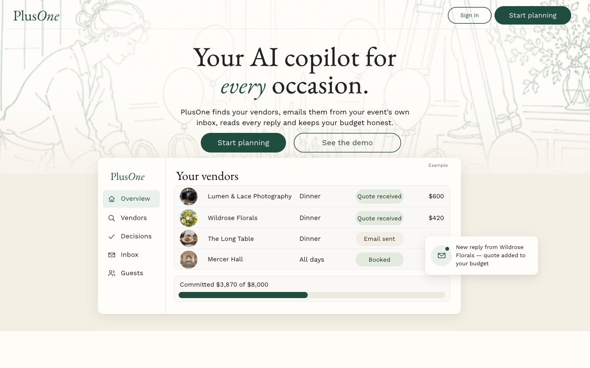
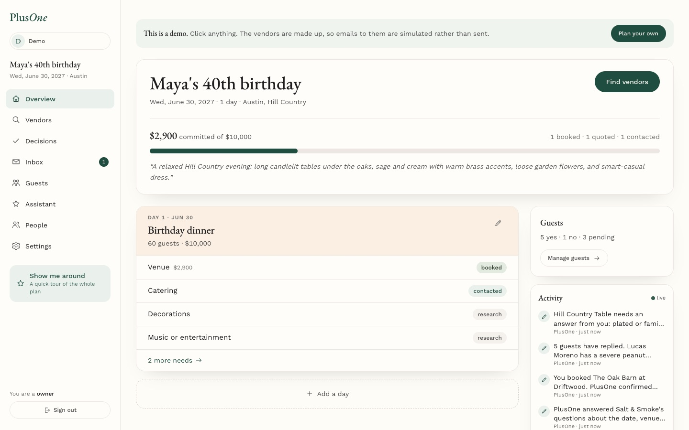

# PlusOne

**Your AI copilot for every occasion.**

Planning a wedding, a birthday or a team event means the same slow work: finding vendors, writing to each one, chasing the ones who go quiet, and turning a pile of replies into prices you can compare. PlusOne does that part. You describe the occasion once, confirm who it should write to, and then you just decide.



## What it does

**Plans any kind of event.** Wedding, engagement, birthday, anniversary, baby shower, graduation, team event or party. Each starts from its own days, the vendors it usually needs and a sensible budget. A wedding also starts from its tradition: Western, Jewish, Hindu, Muslim, Sikh or a fusion of two.

**Finds vendors on the open web.** PlusOne reads each vendor's own website, including the contact and pricing pages most searches never open, and ranks what it finds with a reason for each. Every price links back to the page it came from.

**Does the emailing.** Each event gets its own inbox. PlusOne writes the inquiries, sends them once you have confirmed the shortlist, follows up with anyone who goes quiet, and answers the simple questions vendors ask. Anything that is yours to decide comes back to you as one clear question.

**Turns replies into quotes.** A price in an email, or in a PDF attached to it, becomes a quote you can compare side by side, with what is included, the deposit, and anything worth a second look. The budget moves when a quote arrives.

**Keeps the guest list.** Invitations go out from the event's inbox and guests reply in their own words. "We'd love to, two of us, one vegetarian" is read back onto the list.

**Lets you plan together.** Invite whoever you are planning with. Planners can search and send; everyone else can watch the plan come together, live.



## Care taken

- **You stay in charge.** PlusOne never books, pays or signs. It drafts, sends and chases; every decision is yours.
- **Nobody is pestered.** Follow-ups stop after three. A vendor who asks not to be contacted is never written to again, by any event, and first-contact emails say how to stop them.
- **Your data is yours to remove.** An event can be deleted from its settings and an account from the account page, along with the files they stored.
- **The demo is safe to click.** Its vendors are fictional and its email is simulated, never sent.

## Run it locally

```bash
npm install
npx convex dev          # first run: sign in and create a dev deployment
npm run dev:web         # http://localhost:5173
```

The keys the backend needs are listed in `.env.example` and are set on the deployment, not in a file.

```bash
npm test                # the backend tests
npm run typecheck
```

## Built by

| | |
|---|---|
| **Sharmila Raghu** | [@sharmilaraghu](https://github.com/sharmilaraghu) |
| **Padmanabhan** | [@padmanabhan-r](https://github.com/padmanabhan-r) |

## License

[FSL-1.1-ALv2](LICENSE.md), the Functional Source License. You can read, run and modify PlusOne for anything except offering a competing commercial product. Each version becomes Apache 2.0 two years after it is published.
